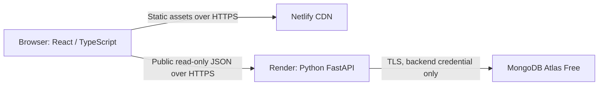

# Application architecture

Status: planned baseline. Lightweight payloads, runtime budgets and cache policy are owned by [performance rules](../rules/performance.md). Decisions: [ADR register](decisions.md). Mandatory constraints: [rules](../rules/README.md).

## Design method

Apply the [first-principles check](../rules/engineering.md#first-principles-design-check) before adding structure. This architecture supplies the initial data flow; feature contracts evolve through the [API/database-first workflow](../rules/workflow.md). Frontend development depends on a ready API contract, and release depends on real backend conformance.

## First vertical slice

One React/Vite frontend, one FastAPI backend, one Atlas database. Netlify hosts static assets; Render hosts the Python process. Vercel was evaluated and rejected on plan eligibility, not on technical fit; see [ADR-005](decisions.md#adr-005-vercel-resource-assumptions). Render is the backend host, not a fallback.

The landing page renders without waiting for the API. It fetches `GET /api/v1/welcome` once with a bounded timeout, renders the response if available, and offers manual retry on failure. Health endpoints validate the server and Mongo wiring. The first slice persists no business data and needs no collection or seed script.

## Backend boundaries

HTTP routes → use-case functions/classes when needed → narrow dependency interfaces → provider adapters. The composition root assembles real implementations and owns lifecycle. Initial health and welcome handlers can stay small; do not create empty domain/service/repository hierarchies. Future feature packages may own their routes, application behavior, domain types and ports as complexity requires. Shared infrastructure owns only actual cross-feature concerns.

FastAPI/Pydantic validate input/output. PyMongo Async supplies Mongo access; use a bounded pool per running process and close it in lifespan. No process-global user sessions, filesystem persistence or import-time I/O. See [backend layout](../backend/README.md) and [database rules](../database-design/README.md).

## Request and failure behavior

1. Browser sends an HTTPS request to the configured API base URL.
2. Middleware supplies a safe request ID, allowed-origin response headers and bounded request processing.
3. Route validates input and calls its dependency; successful DTOs follow [OpenAPI](../api-design/openapi.json).
4. Errors become a safe problem response; logs retain correlation IDs without credentials or personal payloads.

`/health/live` proves the process serves HTTP and does not query Mongo. `/health/ready` checks Mongo with a short deadline and returns 503 on failure. Configure platform health checks against liveness; use readiness in release verification. This avoids restart loops during a database outage. Welcome remains available during that outage.

API CORS allows exact configured frontend/local origins, GET initially, and no credentialed cookies. CORS is browser policy, not authorization. Use separate environment configuration for local, test and hosted prototype; previews must not silently receive production secrets or later customer data.

## Planned extension points

| Requirement trigger | Boundary to introduce | Deferred dependency |
| --- | --- | --- |
| Account-only capability | Identity verifier plus explicit authorization policy | OIDC provider, possibly Keycloak |
| First paid flow | Payment gateway interface and server-owned order use case | Provider SDK and signed webhook |
| Catalog/write-up needs data editing | Feature-specific collection and repository | Approved schema and editing workflow |
| Work must survive request/process termination | Durable job/reconciliation design | Hosting/budget review |

No queues, Redis, microservices, event bus, custom plugin kernel or generic repository framework now. A modular service and stable contracts permit later changes without committing to speculative infrastructure. Identity and payment detail: [security and integrations](security-and-integrations.md).

## Delivery and operations

[HADS-2](../tracker/HADS-2.md) implements the slice and automatic [verification gate](../rules/delivery.md). Build from locked dependencies; test before release; smoke all three endpoints and the page after deployment. Use independent frontend/backend deploys with additive API changes so the previous frontend remains compatible. Keep the previous known-good revision and redeploy it for rollback. Schema changes need their own migration and recovery plan; a code rollback cannot undo data changes.

Acceptance includes an unavailable-API UI test, database-down 503, exact-origin CORS, no leaked URI, and cleanup on failed startup/shutdown. Hosted uptime is best effort under the [free-tier constraints](decisions.md#adr-002-zero-budget-hosting).
